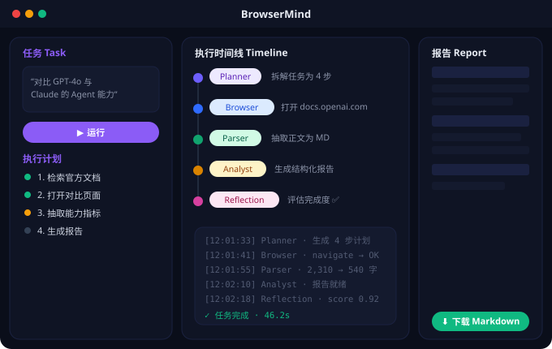
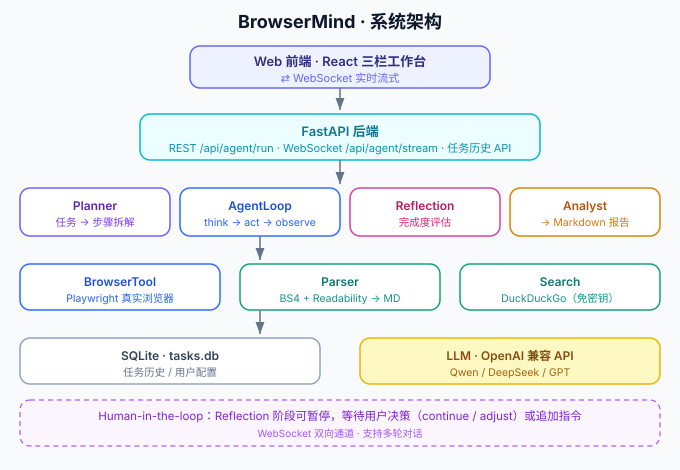

<p align="center">
  <h1 align="center">BrowserMind</h1>
  <p align="center">
    <b>一个能自主规划、操控浏览器、理解网页并生成结构化报告的 AI Agent。</b><br/>
    An autonomous AI agent that plans tasks, controls a real browser, understands web content, and produces structured reports.
  </p>
  <p align="center">
    
    
    
    
  </p>
</p>

---

## ✨ 特性（Features）

- **任务规划（Planner）** — 把自然语言任务自动拆解为可执行步骤。
- **真实浏览器操控（BrowserTool）** — 基于 Playwright 打开页面、点击、输入、滚动、截图，不是“假装”上网。
- **网页理解（Parser）** — 用 BeautifulSoup + Readability + html2text 把杂乱 HTML 提炼成干净 Markdown。
- **结构化报告（Analyst）** — 把收集到的信息整理成可下载的 Markdown 报告。
- **反思与自检（Reflection）** — 评估任务完成度，判断是否需要继续或补充。
- **人在回路（Human-in-the-loop）** — Reflection 阶段可暂停，等待你「继续 / 调整」，并支持追加指令的**多轮对话**。
- **实时可视化工作台** — React 三栏界面，通过 WebSocket 实时展示 Planner / Agent / Parser / Analyst 的执行过程。
- **多模型兼容** — 对接 OpenAI 兼容 API，可切换 Qwen / DeepSeek / GPT 等。

## 🖥️ 界面预览

> 静态示意图（深色三栏工作台：左=任务与计划，中=实时时间线，右=报告）。



> 想要动态 demo？启动服务后用录屏工具capture一段操作，保存为 `docs/demo.gif` 并在此引用即可。

## 🏗️ 架构



```
User → Task Understanding → Planner → Agent Execution Loop
                                        ├─ BrowserTool (Playwright)
                                        ├─ Parser (BeautifulSoup + Readability)
                                        └─ Search (DuckDuckGo)
                                    → Reflection → Completion Check
                                    → Analyst → Markdown Report
```

## 🚀 快速开始

```bash
# 1. 安装依赖
pip install -r requirements.txt
playwright install chromium

# 2. 配置环境变量
cp .env.example .env
# 编辑 .env，填入你的 LLM_API_KEY

# 3. 启动
python main.py
# 浏览器打开 http://localhost:8000
```

> 需要 Python 3.10+。Windows 用户首次运行会自动切换为 `ProactorEventLoop` 以支持 Playwright 子进程。

## ⚙️ 配置

编辑 `.env`（或运行时在前端「设置」面板中修改，立即生效）：

| 变量 | 说明 | 示例 |
|------|------|------|
| `LLM_PROVIDER` | 模型供应商 | `openai` / `deepseek` / `qwen` / `zhipu` |
| `LLM_API_KEY` | API 密钥 | `sk-...` |
| `LLM_MODEL` | 模型名 | `gpt-4o` / `deepseek-chat` |
| `LLM_BASE_URL` | 兼容端点（非 OpenAI 时必填） | `https://api.deepseek.com/v1` |
| `TAVILY_API_KEY` | 可选，留空则回退 DuckDuckGo（免密钥） | — |
| `BROWSER_HEADLESS` | 是否无头模式 | `true` / `false` |
| `PORT` | 服务端口 | `8000` |

常用端点：
- **DeepSeek**：`https://api.deepseek.com/v1`
- **Qwen**：`https://dashscope.aliyuncs.com/compatible-mode/v1`
- **Zhipu**：`https://open.bigmodel.cn/api/paas/v4`

## 🧭 使用方式

- **Web 工作台**：打开 `http://localhost:8000`，在左栏输入任务 → 「运行」，中栏实时看执行，右栏看报告并下载。
- **WebSocket 多轮**：前端通过 `/api/agent/stream` 实时接收过程；可在 Reflection 暂停时发送决策或追加指令。
- **REST 一次性**：`POST /api/agent/run` 提交任务，返回完整结果（适合脚本调用）。

```bash
curl -X POST http://localhost:8000/api/agent/run \
  -H "Content-Type: application/json" \
  -d '{"task":"对比 GPT-4o 与 Claude 在 Agent 任务上的能力，给出结论"}'
```

## 📁 项目结构

```
browsermind/
├── agent/
│   ├── state.py          # 共享状态（task / plan / logs / extracted_info）
│   ├── llm.py            # LLM 客户端 + 工具 schema
│   ├── planner.py        # 任务 → 计划步骤
│   ├── agent_loop.py     # 核心执行循环（think → act → observe）
│   ├── analyst.py        # 抽取信息 → 结构化 Markdown 报告
│   └── reflection.py     # 完成度评估
├── tools/
│   ├── browser.py        # Playwright 封装（6 项能力）
│   ├── search.py         # DuckDuckGo 搜索（免密钥）
│   └── parser.py         # HTML → 干净 Markdown
├── frontend/
│   └── index.html        # React 三栏工作台（CDN 引入）
├── config.py             # 配置（LLM / 浏览器 / 服务）
├── main.py               # FastAPI 入口（REST + WebSocket + 静态托管）
├── store.py              # SQLite 任务存储
├── settings_store.py     # 用户配置（JSON）
└── requirements.txt
```

## 🔌 API 速览

| 方法 | 路径 | 说明 |
|------|------|------|
| `GET` | `/api/health` | 健康检查 |
| `POST` | `/api/agent/run` | 一次性执行任务，返回完整结果 |
| `WS` | `/api/agent/stream` | 实时流式执行 + 多轮对话 |
| `GET` | `/api/tasks` | 任务历史列表 |
| `GET` | `/api/tasks/{id}` | 单个任务详情 |
| `GET/POST/RESET` | `/api/settings` | 读取 / 更新 / 重置配置 |

## 🧰 技术栈

| 层 | 技术 |
|----|------|
| Agent 编排 | 纯 Python 异步循环（think → act → observe） |
| 浏览器自动化 | Playwright |
| 网页解析 | BeautifulSoup + Readability + html2text |
| LLM | OpenAI 兼容 API（Qwen / DeepSeek / GPT） |
| 后端 | FastAPI + WebSocket |
| 前端 | React（CDN）+ WebSocket 实时 UI |

## 🗺️ Roadmap

- [ ] 可插拔工具注册表（让自定义工具更容易接入）
- [ ] 自动评测数据集（验证 Agent 在不同任务上的稳定性）
- [ ] 浅色/深色双主题 + 响应式抽屉（设计稿见 `ui-redesign/`）
- [ ] Docker 化部署
- [ ] 任务结果对比 / 版本管理

## 🤝 贡献

欢迎参与！详见 [CONTRIBUTING.md](CONTRIBUTING.md)。

## 📄 许可证

[MIT](LICENSE) © 2026 BrowserMind Contributors
